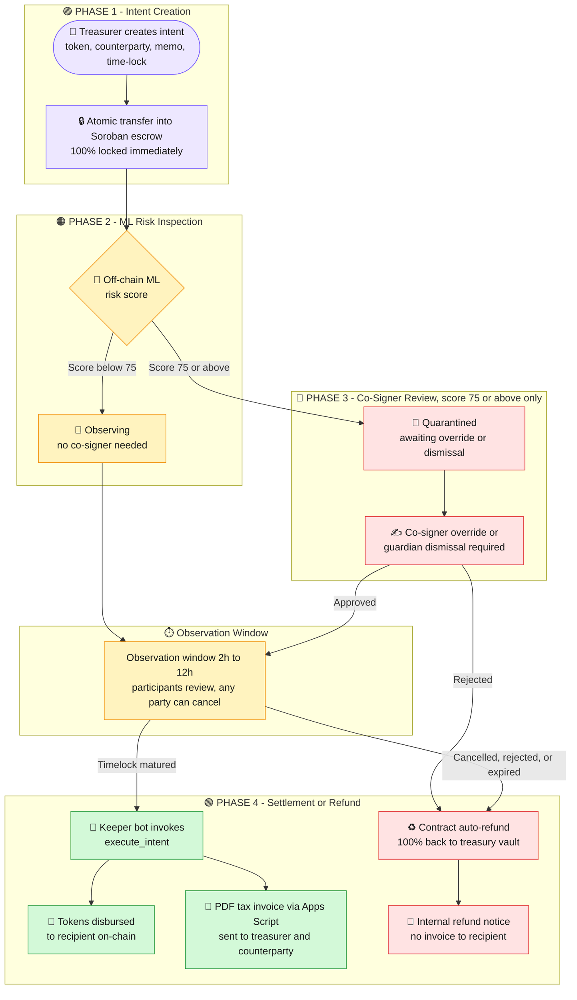

<div align="center">


<br>

### 🛡️ Autonomous Multi-Sig & Machine Learning Treasury Defense Platform

**Every payment becomes an observable, cancellable, auditable lifecycle, not an irreversible mistake.**

<br>


<br>

[🌐 **Live App**](https://stellar-sentinel-five.vercel.app/) &nbsp;•&nbsp; [⚡ **Keeper Service**](https://stellar-sentinel.onrender.com/) &nbsp;•&nbsp; [🔎 **Contract Explorer**](https://stellar.expert/explorer/testnet/contract/CDYQLHZ3KBXVJVC5LGGXJTXXBEIA4BGZHLJKZ3JY2FA4FEGURT7YZ3C2) &nbsp;•&nbsp; [📂 **Repository**](https://github.com/Earth-Kumar-Roy/Stellar-Sentinel)

</div>

---

## 💡 What Is Stellar Sentinel?

**Stellar Sentinel is a safety layer for company crypto payments on Stellar.**

Instead of sending money instantly (and irreversibly), every payment is **locked in an on-chain escrow**, **scored by machine learning**, **held for a 2 to 12 hour review window**, and then **settled automatically or refunded in full**. It is built for corporate vaults and DAO treasuries on the Stellar Soroban network.

<table>
<tr>
<td align="center" width="22%">🔒<br><b>1. LOCK</b><br><sub>Funds move into on-chain escrow immediately</sub></td>
<td align="center" width="4%">➜</td>
<td align="center" width="22%">🧠<br><b>2. SCORE</b><br><sub>ML gives a risk score from 0 to 100</sub></td>
<td align="center" width="4%">➜</td>
<td align="center" width="22%">⏳<br><b>3. OBSERVE</b><br><sub>2h to 12h window, any party can cancel</sub></td>
<td align="center" width="4%">➜</td>
<td align="center" width="22%">✅ / ♻️<br><b>4. SETTLE or REFUND</b><br><sub>Keeper bot pays out, or 100% returns to treasury</sub></td>
</tr>
</table>

<br>

| ❌ A normal crypto transfer | 🛡️ A Stellar Sentinel payment |
|:--|:--|
| Leaves the wallet instantly | Locked in escrow first |
| Irreversible once broadcast | Observable and cancellable during review |
| No checks before money leaves | ML risk score before money can leave |
| One stolen key can drain the wallet | Risky payments (score 75 or above) need a co-signer |
| Mistakes are final | Auto-refund if approvals are missing |

> [!IMPORTANT]
> Private keys never leave the user's Freighter extension. Sentinel never takes custody of signing authority.

---

## 🔗 Important Links

> [!IMPORTANT]
> Everything is deployed on Stellar Testnet. All key links are listed in full below.

|   | Resource | Link |
|:-:|:--|:--|
| 🌐 | **Live dApp** | https://stellar-sentinel-five.vercel.app/ |
| ⚡ | **Backend / Keeper Server** | https://stellar-sentinel.onrender.com/ |
| 📜 | **Smart Contract ID (Testnet)** | `CDYQLHZ3KBXVJVC5LGGXJTXXBEIA4BGZHLJKZ3JY2FA4FEGURT7YZ3C2` |
| 🔎 | **Contract Explorer (Stellar Expert)** | https://stellar.expert/explorer/testnet/contract/CDYQLHZ3KBXVJVC5LGGXJTXXBEIA4BGZHLJKZ3JY2FA4FEGURT7YZ3C2 |

---

## 📑 Table of Contents

| # | Section | # | Section |
|:-:|:--|:-:|:--|
| 1 | [💡 What Is Stellar Sentinel?](#-what-is-stellar-sentinel) | 8 | [🧠 AI and ML Layer](#-ai-and-ml-layer) |
| 2 | [🔗 Important Links](#-important-links) | 9 | [✨ Core Features](#-core-features) |
| 3 | [📖 Overview](#-overview) | 10 | [🧰 Technology Stack](#-technology-stack) |
| 4 | [🎯 The Problem and The Solution](#-the-problem-and-the-solution) | 11 | [📂 Project Structure](#-project-structure) |
| 5 | [🔄 Workflow](#-workflow) | 12 | [🔒 Security Principles](#-security-principles) |
| 6 | [🧱 System Architecture](#-system-architecture) | 13 | [🌍 Deployment](#-deployment) |
| 7 | [🪙 Multi-Currency Support](#-multi-currency-support) and [📜 Blockchain and Smart Contract Layer](#-blockchain-and-smart-contract-layer) | 14 | [🙋 About Me](#-about-me) and [🙏 Acknowledgements](#-acknowledgements) |

---

## 📖 Overview

**Stellar Sentinel** is an autonomous treasury defense protocol on Stellar Soroban that eliminates corporate disbursement risks. It combines instant non-custodial smart contract escrow, dynamic time-lock observation, ML anomaly quarantine, and multi-sig quorums to settle verified payouts or auto-refund unauthorized withdrawals.

Eliminate corporate hot-wallet draining and social engineering attacks. Features instantaneous non-custodial smart contract escrow, dynamic time-lock observation (2H to 12H), off-chain machine learning telemetry, and automated GST tax invoicing.

### ⚡ At a Glance

<table>
<tr>
<td align="center" width="25%">🔐<br><b>Escrow Custody</b><br><br><code>Non-Custodial</code><br><sub>Smart contract SAC lock</sub></td>
<td align="center" width="25%">⏳<br><b>Observation Window</b><br><br><code>2h to 12 Hours</code><br><sub>Configurable timelock</sub></td>
<td align="center" width="25%">🧠<br><b>ML Anomaly Gate</b><br><br><code>≥ 75/100 Quarantine</code><br><sub>Off-chain telemetry engine</sub></td>
<td align="center" width="25%">🤖<br><b>Settlement Engine</b><br><br><code>Autonomous Crank</code><br><sub>Zero user secondary gas</sub></td>
</tr>
</table>

### 🔥 What It Eliminates

| 🔥 Threat | 🛡️ Sentinel's Answer |
|:--|:--|
| Hot-wallet private key drains | Funds sit in an on-chain escrow vault with a time-lock, not in a raw transfer |
| Unauthorized capital flight | Multi-signature quorum for high-risk payments |
| Social-engineering exploits | ML risk scoring flags anomalies before money can leave |
| Rogue insiders | Guardians & counterparties can dispute or cancel during observation |
| Locked or lost capital | Guaranteed auto-refund if approvals are missing |

---

## 🎯 The Problem and The Solution

Traditional enterprise crypto management is fragile: hot-wallet compromise, hasty unverified approvals, rogue insiders, and social engineering. Once a raw transaction is broadcast, funds disappear irreversibly.

**Stellar Sentinel** turns immediate, irreversible execution into an audited, observable lifecycle:

| Step | Stage | What Happens |
|:-:|:--|:--|
| 🟣 **1** | **Non-Custodial Escrow Locking** | 100% of funds are deposited into on-chain Soroban contract storage. The caller keeps ownership while funds enter a programmatic observation quarantine. |
| 🟠 **2** | **Autonomous ML Risk Scoring** | Transactions are analyzed for entropy, destination frequency, volume thresholds, and entity verification history. Scores ≥ 75 / 100 dynamically enforce multi-sig co-signing. |
| 🔵 **3** | **Observation Time-Lock** | Every disbursement is held in public observation: FastPath (2 hours) or Flexible (3 to 12 hours, default 6). Counterparties, auditors, and guardians can dispute or cancel before capital leaves. |
| 🟢 **4** | **Autonomous Settlement & Refund** | When the window elapses and signature thresholds are met, keepers settle automatically. Missing signatures or confirmed anomalies refund 100% to the originating treasury wallet. |

---

## 🔄 Workflow

### 📝 Workflow in Plain Text

| Phase | Name | What Happens | Funds State |
|:-:|:--|:--|:--|
| **1** | **Intent Creation** | Treasurer specifies token, counterparty, purpose memo, and time-lock duration (2h to 12h). | Funds Deducted to Escrow |
| **2** | **ML Risk Inspection** | Off-chain agent scores velocity, counterparty history, entropy, and trust. Score below 75 goes straight to observation with no co-signer needed. Scores 75 or higher trigger instant quarantine. | Timelock Active |
| **3** | **Co-Signer Review** *(score 75 or above only)* | Designated co-signers approve on-chain. If rejected, challenged, or cancelled, funds return immediately to treasury. | Consensus Reached |
| **4** | **Keeper Bot Settlement** | Autonomous crank executes disbursement upon timelock maturation. PDF Tax Invoice is compiled and emailed to both parties. | Final Settlement Complete |

---

### 🎨 Flowchart 1: Color-Coded



---

### 📟 Flowchart 2: Text Boxes

```text
                    ┌───────────────────────────────────────┐
                    │      PHASE 1  -  INTENT CREATION      │
                    │       token, counterparty, memo,      │
                    │     time-lock duration (2h to 12h)    │
                    └───────────────────────────────────────┘
                                        │
                                        ▼
                    ┌───────────────────────────────────────┐
                    │       ATOMIC TRANSFER TO ESCROW       │
                    │    100% locked in Soroban contract    │
                    └───────────────────────────────────────┘
                                        │
                                        ▼
               ┌─────────────────────────────────────────────────┐
               │     PHASE 2  -  OFF-CHAIN ML RISK INSPECTION    │
               │        velocity, history, entropy, trust        │
               │           composite score 0.0 to 100.0          │
               └─────────┬──────────────────────────────────┬────┘
                         │ Score < 75                       │ Score >= 75
                         ▼                                  ▼
          ┌─────────────────────────────┐    ┌─────────────────────────────┐
          │      STATUS: OBSERVING      │    │     STATUS: QUARANTINED     │
          │     No co-signer needed     │    │  PHASE 3 - CO-SIGNER REVIEW │
          │  Standard observation flow  │    │    Co-signer override or    │
          └─────────────────────────────┘    │ guardian dismissal required │
                         │                   └─────────────────────────────┘
                         │                                  │ approved
                         │                                  │
                         └──────────────┬───────────────────┘
                                        ▼
               ┌─────────────────────────────────────────────────┐
               │         OBSERVATION WINDOW  (2h to 12h)         │
               │    participants review, any party can cancel    │
               └─────────┬──────────────────────────────────┬────┘
                         │ cancelled / rejected / expired   │ timelock matured
                         ▼                                  ▼
          ┌─────────────────────────────┐    ┌─────────────────────────────┐
          │         AUTO-REFUND         │    │ PHASE 4 - KEEPER SETTLEMENT │
          │  100% returned to treasury  │    │  bot invokes execute_intent │
          │ internal refund notice only │    │   tokens sent to recipient  │
          │   no invoice to recipient   │    │  PDF tax invoice emailed to │
          └─────────────────────────────┘    │   treasurer and recipient   │
                                             └─────────────────────────────┘
```

---

## 🧱 System Architecture

Stellar Sentinel is a monorepo made of five modules:

| Module | Language | Role |
|:--|:--|:--|
| 🟠 `contracts/` | Rust | The Soroban `sentinel_treasury` contract: on-chain escrow, time-lock, multi-sig, refund logic |
| 🔵 `web/` | TypeScript | Dashboards, wallet flows (Freighter and WebAuthn), in-browser ML scoring through Pyodide |
| 🟡 `agent/` | Python | Keeper, Soroban RPC event subscriber, relayer, risk engine |
| 🟢 `database/` | SQL | Supabase / PostgreSQL schema with Row Level Security |
| 🟣 `integrations/` | JavaScript | Google Apps Script for Gmail notifications and invoice dispatch |

```text
+-----------------------------------------------------------------------------+
|                          WEB dApp  (Vercel, web/)                           |
|  React 18 + Vite + TypeScript + Tailwind                                    |
|  +-------------------+  +------------------------+  +--------------------+  |
|  | Dashboards / Forms|  | Pyodide WASM ML Scorer |  | Freighter/WebAuthn |  |
|  +-------------------+  +------------------------+  +--------------------+  |
+-------+---------------------------+-------------------------+---------------+
        |                           |                         |
        | read / write              | notifications           | invoke + sign
        v                           v                         v
+------------------+     +----------------------+    +----------------------+
| Supabase         |     | Google Apps Script   |    | Soroban RPC          |
| PostgreSQL + RLS |     | (integrations/)      |    +----------+-----------+
| (database/)      |     | Gmail + PDF invoices |               |
+--------^---------+     +----------------------+               v
         |                                          +----------------------+
         | sync                                     | sentinel_treasury    |
         |                                          | Rust smart contract  |
+--------+-----------------------------+            | (contracts/)         |
|  KEEPER / AGENT  (Render, agent/)    |  events    | escrow, time-lock,   |
|  main.py (polling loop)              |<-----------| multi-sig, refund    |
|  listeners/soroban_subscriber.py     |            +----------+-----------+
|  engine/risk_scorer.py               |  settle /             |
|  dispatch/relayer.py                 |--challenge----------->| SAC tokens
+--------------------------------------+                       | XLM, USDC, EURC
```

---

## 🪙 Multi-Currency Support

Sentinel natively supports Stellar Lumens and fiat-backed stablecoins via the Stellar Asset Contract (SAC) standard. Outbound disbursements can be denominated in Native Stellar Lumens (XLM) or regulated stablecoins (USDC and EURC). All supported assets conform to the 7-decimal Stroop standard (1 Stroop = 0.0000001 tokens) under official Soroban Asset Contracts (SAC).

| Token | Asset | Contract Address | Standard | Decimals |
|:--|:--|:--|:--|:-:|
| 🟣 **XLM** | Stellar Lumens | `CDLZFC3SYJYDZT7K67VZ75HPJVIEUVNIXF47ZG2FB2RMQQVU2HHGCYSC` | Native Protocol SAC | 7 |
| 🔵 **USDC** | USD Coin | `CBPD6XGRX4VF5CIBDLLYQCBV7UG6ZW7CTZE3FSWKD73JMNIJJ73MDJKK` | Stellar Asset Contract | 7 |
| 🟡 **EURC** | Euro Coin | `CCEWDNGDQZRTSBQLDZZEPNFPL3R7NZTVBNRDKT6AZ436L6X6V5OL56QN` | Stellar Asset Contract | 7 |

> [!NOTE]
> Co-signing is required whenever an intent's ML risk score is ≥ 75.

<details>
<summary><b>💻 Token configuration in the web app (TypeScript)</b></summary>

```typescript
export const SUPPORTED_TOKENS: Record<string, TokenAsset> = {
  XLM: {
    symbol: 'XLM',
    name: 'Stellar Lumens',
    contractId: 'CDLZFC3SYJYDZT7K67VZ75HPJVIEUVNIXF47ZG2FB2RMQQVU2HHGCYSC',
    decimals: 7,
    isNative: true,
  },
  USDC: {
    symbol: 'USDC',
    name: 'USD Coin',
    contractId: 'CBPD6XGRX4VF5CIBDLLYQCBV7UG6ZW7CTZE3FSWKD73JMNIJJ73MDJKK',
    decimals: 7,
  },
  EURC: {
    symbol: 'EURC',
    name: 'Euro Coin',
    contractId: 'CCEWDNGDQZRTSBQLDZZEPNFPL3R7NZTVBNRDKT6AZ436L6X6V5OL56QN',
    decimals: 7,
  },
};
```

</details>

---


## 📜 Blockchain and Smart Contract Layer

The primary state machine is defined in Rust (`SentinelTreasury` in `contract.rs`), compiling to WebAssembly on the Soroban execution environment. When the treasurer submits an intent, funds are immediately deducted from the caller and locked in non-custodial smart contract escrow.

### 🗺️ Contract Source Map (`contracts/sentinel_treasury/src/`)

| File | Responsibility |
|:--|:--|
| 🦀 `contract.rs` | Core treasury logic (create, challenge, execute) |
| 🚨 `errors.rs` | Standardized error definitions |
| 📦 `lib.rs` | Contract crate root and interface exports |
| 💾 `storage.rs` | Instance/persistent storage and TTL management |
| 🧪 `test.rs` | Soroban unit and integration tests |
| 🧬 `types.rs` | Storage keys, payment intents, and struct types |

### 🔒 Immediate Escrow Transfer Mechanism

During `create_intent`, the contract executes an atomic transfer from the caller to the contract address via the Soroban Token SAC Client. Funds do not sit in the user's wallet during observation, eliminating double-spend and unauthorized balance drainage:

```rust
// Lock funds immediately into contract escrow
token::Client::new(&env, &asset).transfer(
    &caller,
    &env.current_contract_address(),
    &(amount as i128),
);
```

### 🧬 Core State Structure: `PaymentIntent`

```rust
pub struct PaymentIntent {
    pub id: u64,
    pub sender: Address,
    pub recipient: Address,
    pub asset: Address,
    pub amount: i64,
    pub purpose_hash: BytesN<32>,
    pub status: IntentStatus,
    pub tier: ExecutionTier,
    pub created_at: u64,
    pub observation_until: u64,
    pub expires_at: u64,
    pub cosigners: Vec<Address>,
    pub guardian: Option<Address>,
    pub approvals: Vec<Address>,
    pub guardian_approvals: Vec<Address>,
    pub policy_version: u32,
    pub observation_delay: u64,
}
```

### 🔑 Key Contract Interfaces

<table>
<tr>
<th align="left" width="30%">Function</th>
<th align="left">What It Does</th>
</tr>
<tr>
<td valign="top">

`create_intent(caller, recipient, cosigners, guardian, asset, amount, purpose_hash, delay)`

</td>
<td valign="top">Validates policy boundaries, transfers tokens into contract escrow, determines the required execution tier, and publishes the <code>(intent, created)</code> event.</td>
</tr>
<tr>
<td valign="top">

`execute_intent(caller, intent_id)`

</td>
<td valign="top">Settles matured disbursements. If observation time has elapsed and required multi-sig signatures are present, funds are released to recipient. If quorum is unsatisfied upon deadline expiration, the contract automatically auto-refunds back to the treasurer.</td>
</tr>
<tr>
<td valign="top">

`cancel_intent(caller, intent_id)`

</td>
<td valign="top">Callable by the sender, any designated co-signer, or the guardian. Immediately refunds escrowed tokens to the sender and marks the intent terminal (<code>Cancelled</code>).</td>
</tr>
</table>

### ⏱️ Observation Timelocks & Multi-Sig Quorums

The timelock provides a security buffer (configurable between **2 Hours (7,200s)** and **12 Hours (43,200s)**). During this active timeframe, participants can review the transaction, co-signers can submit required cryptographic approvals, or any party can cancel and refund the escrow if an anomaly is detected.

| ML Risk Score | Tier Identification | Quorum Mandate | Observation Policy |
|:--|:--|:--|:--|
| 🟢 Below 75 | `FastPath` | No co-signer needed | Direct observation (2h - 12h) |
| 🔴 75/100 or higher | `Quarantined` | Co-Signer Override or Guardian Dismissal | Auto-refunds upon timelock expiry |

### ♻️ Guaranteed Escrow Auto-Refund

If any co-signer rejects the transaction, if the sender cancels, or if the observation timelock matures without the required co-signer signatures present on-chain, the contract immediately releases the escrowed tokens straight back to the treasury wallet. Funds are never lost or stuck permanently in the contract.

### 🤖 Autonomous Keeper Crank: Two-Step vs Automatic

Soroban smart contracts are reactive and cannot execute operations on their own clock. Stellar Sentinel uses an autonomous Python keeper bot (`soroban_subscriber.py`) operating as a decentralized crank. Users do not need to manually confirm or approve transactions a second time once created. Once the observation window has safely matured and all signatures (if mandated) have been gathered, the backend bot automatically submits `execute_intent` on-chain.

| Path | Trigger | Result |
|:--|:--|:--|
| ✅ **Maturation & Settlement Path** | Current time is greater than or equal to `observation_until` and co-signer criteria are satisfied | The keeper bot calls `execute_intent`. Tokens are disbursed directly to the recipient address and an on-chain event is published. |
| ♻️ **Unapproved / Anomaly Refund Path** | Mandatory co-signers did not approve before deadline expiration, or an unresolved quarantine flag exists | Calling `execute_intent` automatically reverses the escrow, returning 100% of tokens to the sender treasury. |

### 🚨 Soroban Contract Diagnostic Error Matrix

Standard contract errors defined in `errors.rs` and returned by Soroban simulation or consensus:

| Code | Error Identifier | Diagnostic Remediation |
|:-:|:--|:--|
| `#10` | `EmergencyFrozen` | Contract operations paused by protocol admin emergency key. |
| `#12` | `InvalidIntentParameters` | Observation timelock must be between 2 Hours (7,200s) and 12 Hours (43,200s). Amount must be greater than 0. |
| `#13` | `ObservationWindowActive` | Settlement attempted before timelock has matured. Await keeper crank. |
| `#14` | `IntentAlreadyTerminal` | Intent is already executed, cancelled, or refunded. Cannot re-execute. |
| `#15` | `IntentIsQuarantined` | Quarantined by ML Sentinel. Requires Co-Signer override or Guardian dismissal. |
| `#16` | `CosignerRequired` | A co-signer approval is required before this disbursement can settle. |
| `#20` | `AmountExceedsPerTxLimit` | Transfer volume exceeds the maximum per-transaction ceiling configured in protocol policy. |

---


## 🧠 AI and ML Layer

Every payment intent is ingested by an autonomous Python machine learning telemetry pipeline (`risk_scorer.py`). The engine evaluates four primary dimensions to detect corporate exfiltration and anomalous transfers.

### 🗺️ Where the AI Runs

| Location | Files | Role |
|:--|:--|:--|
| 🖥️ **In the browser** (Pyodide WASM) | `web/public/py_agent/pipeline.py`, `web/public/py_agent/risk_scorer.py`, `web/public/py_agent/models/`, `web/src/services/pyodideScorer.ts` | Runs machine learning inference directly in the browser using Python compiled to WebAssembly, and produces an instant risk score before the payment is signed |
| 🧩 **Frontend heuristics** | `web/src/utils/riskScorer.ts` | Frontend heuristic risk evaluation |
| 🤖 **On the keeper agent** (Python) | `agent/engine/risk_scorer.py`, `agent/ml/pipeline.py`, `agent/ml/models/` | Feature extraction and inference pipeline, risk evaluation and scoring logic, pre-trained model weights / artifacts |

### 🔬 The Four Primary Detection Dimensions

| # | Dimension | What It Checks | Trigger and Effect |
|:-:|:--|:--|:--|
| **1** | 🌊 **Global Treasury Entropy Anomaly** | Calculates the moving baseline of the treasury's last **25** executed transfers. | A volume spike greater than **30x** the baseline triggers a **+50 penalty** and mandates multi-sig approval. |
| **2** | 🔁 **Post-Cosign Frequency Clustering** | Checks clustering in the last **12** disbursements. | If **9 or more out of 12** transfers are routed to the same wallet without co-signer validation, the engine flags a **+48 anomaly penalty**. |
| **3** | 🏢 **GST Corporate Registry & Wallet Trust** | Cross-references the counterparty against verified GST organizations. | Verified entities receive trusted operational status, while independent wallets mandate co-signers on transfer **#2**. |
| **4** | 📈 **Relative Counterparty Volume Surge** | Tracks the recipient's historical **8-transfer** average. | If the current amount spikes **25x or higher** over historical baseline, it forces an automated quarantine. |

### 🧮 Mathematical Composite Scoring Formula

```text
RiskScore = w1 · V + w2 · (1 - T) + w3 · D + w4 · H
```

| Symbol | Meaning |
|:-:|:--|
| **V** | Velocity deviation |
| **T** | Counterparty trust score |
| **D** | Time-of-day risk |
| **H** | Memo hash entropy |

### 🚦 Score Levels and Outcomes

| Score | Level | Effect |
|:--|:--|:--|
| 🟢 **0 to 74.9** | Normal | Standard observation flow (`Observing` / `AwaitingApproval`), no co-signer needed |
| 🔴 **75.0 to 100** | High | The intent is placed into `QUARANTINED` status, requiring an explicit co-signer signature override or guardian review before it can ever disburse. |

### 🧾 What the ML Evaluates (summary)

- Transaction frequency, entropy, registered vs unregistered wallet status, destination wallet velocity, counterparty trust, and exposure risk limits.
- Counterparty trust history, volume surge (>30x baseline), post-cosign frequency clustering, and memo entropy to autonomously quarantine anomalous payouts.
- Recipient verification (registered or unregistered entity) feeds directly into the ML risk score.
- Built to prevent fund theft and give treasuries a trustworthy payment system.

---

## ✨ Core Features

### 🚀 Headline Feature: Approve Once, Settles Automatically

The Treasurer grants permission once and fixes the observation time. After that, no manual step is needed. The payment settles **AUTOMATICALLY** when all of these conditions are met:

| ✅ Condition | What Must Be True |
|:--|:--|
| 🧠 **ML status is OK** | Risk score is acceptable, or flagged risk has been cleared through co-signing |
| ✍️ **Co-signer fulfilled** | If the intent was quarantined (risk ≥ 75), the required co-signer approval is signed |
| ⏱️ **Time-lock matured** | The fixed observation window (2H FastPath or 3H to 12H Flexible) has elapsed |

**All met → 🟢 the keeper settles the payment on-chain &nbsp;|&nbsp; Signatures missing → 🔴 the contract auto-refunds the treasury.**

---

### ⏱️ 1. Dual-Path Observation Time-Lock

| Path | Window | Best For |
|:--|:--|:--|
| ⚡ **FastPath Settlement** | 2 hours (120 min, fixed) | Routine operational expenses and low-risk vendor payments |
| 🎚️ **Flexible Governance** | 3H to 12H (default 6H / 360 min) | Large capital movements. An interactive stepper slider lets treasurers give compliance teams an audit cushion |

### 🧠 2. Client-Side ML Telemetry (Pyodide WASM)

- Runs machine learning inference directly in the browser using Python compiled to WebAssembly.
- Produces an instant risk score from 0.0 to 100.0.
- See the [🧠 AI and ML Layer](#-ai-and-ml-layer) for the full detection model.

### ✍️ 3. Threshold Multi-Signature Quorum

- Mandatory 1-of-2 / 2-of-2 co-signing for ML-flagged transactions.
- When risk is 75 or above, a co-signer is assigned automatically.
- Officers sign in with assigned company wallets, review audit notes, and submit on-chain approvals via Freighter.

### 🤖 4. Autonomous Keeper Settlement & Auto-Refund

- Independent backend subscribers monitor ledger events and calculate maturity horizons.
- Zero secondary gas or manual confirmation required. Once observation timelocks clear and required multi-sig approvals are signed, the keeper bot settles on-chain.
- ✅ **Disbursement Path:** Timelock matured and all co-signer approvals sealed → keeper executes settlement and delivers tokens to the recipient.
- ♻️ **Safety Auto-Refund:** Timelock elapsed with unfulfilled signatures → contract auto-refunds the full escrowed amount to the treasury.

### 🏢 5. Multi-Tenant, Role-Based Organizations

| Role | Responsibilities | Dashboard View |
|:--|:--|:--|
| 🟦 **Treasurer** | Creates payments, manages volume limits | Payment creation & limits |
| 🟩 **Signer** (also named **Guardian**) | Reviews and approves quarantined intents, and can dispute or cancel suspect transactions | Multi-sig approval queue and quarantine review |

> [!NOTE]
> Signer and Guardian share the same dashboard and the same entitlements. They are different names for the same kind of approving officer.

- **Registered Wallets Only:** Only registered wallets can join the platform, through Entity Registration with an organizational tax profile. Roles are assigned as Treasurer or Signer / Guardian.
- **Identity Isolation:** Queues are isolated per organization, preventing counterparty cross-contamination.

### 🧾 6. Automated GST Invoicing & Audit Ledgers

- **Invoice Explorer:** Paginated browser with instant search across Intent ID, Transaction Hash, Counterparty Wallet, and Memo Reference.
- **Tax-Compliant PDF Receipts:** Itemized receipts with corporate identifiers, on-chain execution hashes, timestamps, and multi-sig roster proofs.
- **Automated Email Dispatch:** Emails are sent to Treasurers, Signers, and Recipients at intent creation and again on quarantine alerts and the final payment status (settled or refunded).

Every treasury lifecycle event synchronizes through Google Apps Script webhooks (`google-apps-script.js`) for real-time compliance alerting and invoice dispatch across four distinct states:

| Step | Email | Details |
|:-:|:--|:--|
| **1** | 📨 **Intent Creation Email** | Dispatched immediately to the treasurer upon intent submission, confirming the amount, currency, recipient address, ML score, and timelock window. |
| **2** | ✍️ **Co-Signer Mandate Notice** | If co-signers are designated or mandated by the risk threshold, automated notifications are dispatched directly to the co-signers' registered email addresses with deep links to sign. |
| **3** | 🧾 **Settlement Tax Invoice & PDF Dispatch** | When payment is executed/settled, the system generates an official corporate PDF Tax Invoice with GSTIN details, on-chain tx hash, and transaction note, emailing it to both the treasurer and the recipient entity. |
| **4** | 🚨 **Anomaly Refund Alert** | Sent strictly to internal treasury officers when an intent is cancelled or quarantined; suppressed for the counterparty. If cancelled or refunded, no invoice is ever sent to the counterparty. |

### 📝 7. Entity Registration & GST Document Verification

- Drag-and-drop GST document upload during onboarding.
- Document validation and OCR checks (MediaPipe-based) before an organization is accepted.

### 📊 8. Multi-Dashboard Experience

| Dashboard | For | Highlights |
|:--|:--|:--|
| 🟦 **Treasury Operations** | Treasurer | Payment creation, volume limits, operations overview |
| 🟩 **Approval & Review** | Signer / Guardian | Quarantine review, multi-sig approval queue |
| 🟪 **Ongoing Intents** | All roles | Active and challenged payment intents in real time |
| 🟧 **Wallet Activity Feed** | All roles | Real-time wallet event stream |

The in-app navigation covers: **Overview**, **Ongoing Queue**, **Company History**, **Invoices & Receipts**, **Org Explorer**, **My Organization**, **Wallet History**, **Direct P2P Transfer**, **Entity Registration**, and **Documentation**.

### 🔍 9. Organization Directory & Recipient Verification

- Organization search with public organization profile pages.
- Recipient verification badge on the payment form showing whether the destination is a registered or unregistered entity.
- Feeds directly into the ML risk score.

### 🗂️ 10. Dual Ledger & Company History

- Dual transaction table that shows on-chain (Soroban) and off-chain (database) records side by side, kept in sync.
- Company transaction history page as a complete historical ledger.
- Direct Transfer page for quick transfers.

### ⚙️ 11. Policy-Driven Configuration

- `policy.json`: risk thresholds and transaction rules.
- `signers.json` and `guardians.json`: authorized multi-sig signers and guardian configurations.
- `agents.json`: configured agent metadata.

### 📚 12. Built-In Documentation

- An in-app Documentation page with API and user guides.

---

## 🧰 Technology Stack

### 🧱 Full Stack Overview

| Layer | Technologies |
|:--|:--|
| 🔗 **Smart Contracts & Blockchain** | Rust • Soroban SDK • Soroban Smart Contracts • WASM (WebAssembly) • Stellar Asset Contract (SAC) • Stellar Testnet Ledger • Stellar Expert • Cargo |
| 🖥️ **Frontend & Client Applications** | React 18 • TypeScript • Vite • Tailwind CSS • Lucide React • Pyodide (Python in WebAssembly) |
| 🌐 **Web3 & Protocol SDKs** | Freighter Wallet API • WebAuthn • @stellar/stellar-sdk • Soroban RPC Client |
| 🧠 **Machine Learning & Vision** | Pyodide (in-browser inference) • Scikit-learn • NumPy • MediaPipe • OCR |
| 🤖 **Backend & Autonomous Keepers** | Python 3.11 • stellar-sdk (Python) • HTTPX (async networking) • Soroban RPC Event Subscriber |
| 🗄️ **Database & Storage** | Supabase • PostgreSQL • Row Level Security (RLS) |
| 📨 **Messaging & Automation** | Google Apps Script (REST microservices) • Gmail |
| 🚢 **CI/CD & Cloud Infrastructure** | GitHub Actions • Vercel Edge Platform • Render Cloud Container Services |

### 🗣️ Languages and Where They Are Used

| Language | Used For |
|:--|:--|
| 🔷 **TypeScript** | The React + Vite web app: dashboards, wallet flows, hooks, services, and the Pyodide scoring bridge |
| 🐍 **Python** | The keeper agent, event subscriber, relayer, risk engine, ML pipeline, and the in-browser Pyodide scorer |
| 🦀 **Rust** | The Soroban `sentinel_treasury` smart contract |
| 🟨 **JavaScript** | Google Apps Script for Gmail alerts and PDF invoice dispatch |
| 🐘 **PLpgSQL / SQL** | The Supabase / PostgreSQL schema with Row Level Security |

### 🧠 AI and Risk Scorer Tech Stack (Detailed)

| Component | Technology | Role in the Risk Scorer |
|:--|:--|:--|
| 🐍 **Server runtime** | Python 3.11 | Runs the keeper agent, `risk_scorer.py`, and the `pipeline.py` feature and inference pipeline |
| 🌐 **Browser runtime** | Pyodide (Python on WebAssembly) | Runs the same style of scoring directly in the browser, with no server round trip |
| 🤖 **Machine learning library** | Scikit-learn | Machine learning models and inference used by the scoring pipeline |
| 🔢 **Numerical computing** | NumPy | Numerical computation for feature extraction and scoring |
| 📦 **Model artifacts** | `agent/ml/models/` and `web/public/py_agent/models/` | Pre-trained model weights / artifacts for the server and the browser |
| 🧮 **Risk engine** | `risk_scorer.py` | Evaluates the four detection dimensions and the composite `RiskScore` formula |
| 🔧 **Feature pipeline** | `pipeline.py` | Feature extraction and inference pipeline |
| 🧩 **Frontend bridge** | `pyodideScorer.ts`, `riskScorer.ts`, `pyodide.d.ts` | Calls the in-browser scorer, provides frontend heuristic risk evaluation, and types for Pyodide |
| 🔌 **Async networking** | HTTPX | Async networking for the Python keeper agent |
| ⛓️ **Chain feed** | Soroban RPC Event Subscriber | Streams ledger events that feed the telemetry the scorer evaluates |
| 🗄️ **History source** | Supabase / PostgreSQL | Off-chain records of transactions and organizations kept in sync with on-chain data |

---

## 📂 Project Structure

### 🧭 Module Map

| Module | Language | Purpose |
|:--|:--|:--|
| 🟠 `contracts/` | Rust | On-chain escrow, time-lock, multi-sig, refund logic |
| 🔵 `web/` | TypeScript | Dashboards, wallet flows, in-browser ML scoring |
| 🟡 `agent/` | Python | Keeper, ledger subscriber, relayer, risk engine |
| 🟢 `database/` | SQL | Supabase schema with Row Level Security |
| 🟣 `integrations/` | JavaScript | Gmail notifications and invoice dispatch |

### 🌳 Full Monorepo Tree

<details open>
<summary><b>📁 Click to collapse or expand the full monorepo tree</b></summary>

```text
Stellar-Sentinel/
├── .cargo/
│   └── config.toml                          # Cargo compilation settings (jobs=1, low RAM safety)
├── .github/
│   └── workflows/
│       ├── deploy.yml                       # Deployment CI/CD workflow
│       └── test-contracts.yml               # Soroban contract testing workflow
│
├── agent/                                   # Python risk analysis and listener backend
│   ├── dispatch/
│   │   └── relayer.py                       # Transaction relayer and on-chain challenge dispatcher
│   ├── engine/
│   │   └── risk_scorer.py                   # Risk evaluation and scoring logic
│   ├── listeners/
│   │   └── soroban_subscriber.py            # Soroban RPC event subscriber and DB sync
│   ├── ml/
│   │   ├── models/                          # Pre-trained model weights / artifacts
│   │   └── pipeline.py                      # Feature extraction and inference pipeline
│   ├── .env.example                         # Environment configuration template
│   ├── core.py                              # Core agent configuration, RPC clients, and utilities
│   ├── main.py                              # Service entrypoint and scheduled polling loop
│   ├── render.yaml                          # Render deployment configuration
│   └── requirements.txt                     # Python dependencies
│
├── contracts/                               # Soroban smart contracts workspace (Rust)
│   ├── .cargo/
│   │   └── config.toml                      # Contract-specific build profile
│   ├── sentinel_treasury/                   # Treasury smart contract crate
│   │   ├── src/
│   │   │   ├── contract.rs                  # Core treasury logic (create, challenge, execute)
│   │   │   ├── errors.rs                    # Standardized error definitions
│   │   │   ├── lib.rs                       # Contract crate root and interface exports
│   │   │   ├── storage.rs                   # Instance/persistent storage and TTL management
│   │   │   ├── test.rs                      # Soroban unit and integration tests
│   │   │   └── types.rs                     # Storage keys, payment intents, and struct types
│   │   └── Cargo.toml                       # Package manifest for sentinel_treasury
│   └── Cargo.toml                           # Workspace manifest
│
├── database/                                # Supabase / PostgreSQL schema
│   └── schema.sql                           # Tables (organizations, transactions, policies)
│
├── integrations/                            # External automation connectors
│   └── google-apps-script.js                # Google Apps Script for Gmail alerts & invoices
│
├── web/                                     # React + Vite + TypeScript frontend
│   ├── public/
│   │   ├── py_agent/                        # In-browser client Python agent
│   │   │   ├── models/                      # In-browser model files
│   │   │   ├── pipeline.py                  # Pyodide data pipeline
│   │   │   └── risk_scorer.py               # Pyodide scoring implementation
│   │   ├── favicon.svg
│   │   └── Logo.svg
│   ├── src/
│   │   ├── components/
│   │   │   ├── invoice/
│   │   │   │   └── InvoiceReceiptModal.tsx  # Invoice receipt viewing modal
│   │   │   ├── layout/
│   │   │   │   ├── Navbar.tsx               # Top navigation bar
│   │   │   │   └── Sidebar.tsx              # Application sidebar navigation
│   │   │   ├── payment/
│   │   │   │   ├── PaymentForm.tsx          # Payment submission interface
│   │   │   │   └── RecipientOrgCard.tsx     # Recipient verification badge & details
│   │   │   ├── registration/
│   │   │   │   └── GstUploadDropzone.tsx    # Drag-and-drop document upload
│   │   │   ├── search/
│   │   │   │   └── OrgSearchBar.tsx         # Organization search input
│   │   │   └── transactions/
│   │   │       ├── DualTransactionTable.tsx # Dual ledger view (on-chain vs off-chain sync)
│   │   │       ├── IntentDetailModal.tsx    # Payment intent inspect and action modal
│   │   │       └── StatusBadge.tsx          # Transaction status badge
│   │   ├── config/
│   │   │   ├── constants.ts                 # Contract IDs, network passphrases, and endpoints
│   │   │   └── supabase.ts                  # Supabase client singleton
│   │   ├── hooks/
│   │   │   ├── useDualTransactions.ts       # Hook for joint Soroban and DB transaction feeds
│   │   │   ├── useOrganization.ts           # Connected organization state
│   │   │   ├── useRecipientOrg.ts           # Dynamic recipient lookup hook
│   │   │   └── useWallet.ts                 # Stellar wallet connection hook
│   │   ├── pages/
│   │   │   ├── CompanyTransactionHistory.tsx# Historical ledger page
│   │   │   ├── Dashboard.tsx                # Treasury operations overview
│   │   │   ├── DirectTransfer.tsx           # Quick transfer page
│   │   │   ├── Documentation.tsx            # API and user documentation view
│   │   │   ├── InvoiceExplorer.tsx          # Invoice viewer and explorer
│   │   │   ├── LandingPage.tsx              # Public landing page
│   │   │   ├── MakePayment.tsx              # Payment initiation flow
│   │   │   ├── OngoingIntents.tsx           # Active and challenged payment intents
│   │   │   ├── OrganizationDisplay.tsx      # Organization public profile page
│   │   │   ├── OrganizationSearch.tsx       # Organization directory search
│   │   │   ├── RegisterOrganization.tsx     # Onboarding and verification flow
│   │   │   └── WalletActivityFeed.tsx       # Real-time wallet event stream
│   │   ├── services/
│   │   │   ├── appsScript.ts                # Google Apps Script client
│   │   │   ├── contractClient.ts            # Soroban RPC client and contract invocation
│   │   │   ├── pyodideScorer.ts             # In-browser Pyodide scoring service
│   │   │   ├── stellar.ts                   # Stellar network SDK client
│   │   │   └── wallet.ts                    # Freighter and WebAuthn adapter
│   │   ├── types/
│   │   │   └── pyodide.d.ts                 # Pyodide type definitions
│   │   ├── utils/
│   │   │   ├── mediapipeValidator.ts        # Document validation and OCR checks
│   │   │   └── riskScorer.ts                # Frontend heuristic risk evaluation
│   │   ├── App.tsx                          # Root React component and route definitions
│   │   ├── index.css                        # Global Tailwind styles
│   │   ├── main.tsx                         # DOM mount entrypoint
│   │   └── types.ts                         # Consolidated contract, DB, and UI types
│   ├── package.json                         # Web dependencies and build scripts
│   ├── tailwind.config.js                   # Styling system config
│   ├── tsconfig.json                        # TypeScript compiler config
│   ├── vercel.json                          # Vercel SPA routing and deployment rules
│   └── vite.config.ts                       # Vite bundler build config
│
├── .gitignore                               # Project-wide Git ignore rules
├── agents.json                              # Configured agent metadata
├── guardians.json                           # Guardian multi-sig configurations
├── policy.json                              # Risk thresholds and transaction rules
├── signers.json                             # Authorized multi-sig signers
└── README.md                                # Project overview and architecture guide
```

</details>

---

## 🔒 Security Principles

| | Principle | Guarantee |
|:-:|:--|:--|
| 🔑 | **Non-Custodial Architecture** | Private keys never leave the user's Freighter extension. Contracts use native Soroban `require_auth()` across callers and designated officers. |
| ⏳ | **Time-Lock Quarantine** | Eliminates instant wallet-drain attacks by giving officers a buffer to cancel or dispute compromised transactions. |
| ♻️ | **Guaranteed Auto-Refunds** | Unsigned or expired intents refund to the treasury vault, preventing locked capital. |
| ✅ | **Verified Contract Binaries** | All Soroban contract instances are verified and trackable on Stellar Expert. |

> [!WARNING]
> Stellar Sentinel currently runs on Stellar Testnet. Do not use it with real funds until it has been independently audited.

---

## 🌍 Deployment

| Component | Platform | Link |
|:--|:--|:--|
| 🖥️ **Frontend Dashboard** | Vercel | https://stellar-sentinel-five.vercel.app/ |
| 🤖 **Autonomous Keeper Daemon** | Render | https://stellar-sentinel.onrender.com/ |
| ⛓️ **Blockchain Network** | Stellar | Stellar Testnet |
| 📜 **Smart Contract ID** | Soroban | `CDYQLHZ3KBXVJVC5LGGXJTXXBEIA4BGZHLJKZ3JY2FA4FEGURT7YZ3C2` |
| 🔎 **Contract Explorer** | Stellar Expert | [View on Stellar Expert](https://stellar.expert/explorer/testnet/contract/CDYQLHZ3KBXVJVC5LGGXJTXXBEIA4BGZHLJKZ3JY2FA4FEGURT7YZ3C2) |

### 🔁 CI/CD & Deployment Configuration

| File | Purpose |
|:--|:--|
| 🟢 `.github/workflows/deploy.yml` | Deployment CI/CD workflow |
| 🟡 `.github/workflows/test-contracts.yml` | Soroban contract testing workflow |
| 🔵 `web/vercel.json` | Vercel SPA routing and deployment rules |
| 🟣 `agent/render.yaml` | Render deployment configuration for the keeper |

> [!NOTE]
> The contract is deployed on Stellar Testnet. Confirm the live dApp, keeper, and contract ID above before integrating.

---

## 🙋 About Me

**Earth Kumar Roy** — Architect & Lead Protocol Engineer

Specializing in production Web3 smart contract architectures, zero-knowledge verification frameworks, and automated decentralized keeper infrastructure on Stellar Soroban.

| | Platform | Link |
|:-:|:--|:--|
| 💼 | **LinkedIn** | https://www.linkedin.com/in/earth-kumar-roy/ |
| 🐦 | **X / Twitter** | https://x.com/Earth_Kumar_Roy |
| 👤 | **GitHub** | https://github.com/Earth-Kumar-Roy |
| 💬 | **Leave a Message** | https://sites.google.com/view/ekr1/leave-a-message |

---

## 🙏 Acknowledgements

- 🌟 **Stellar Development Foundation (SDF)** for pioneering high-efficiency decentralized infrastructure
- 🦀 **Soroban Developer Community** for Rust contract documentation and SDK tooling
- 🔐 **Freighter Wallet Engineering Team** for secure transaction signing adapters
- 🐍 **Pyodide Team** for client-side Python WebAssembly capabilities
- ☁️ **Vercel & Render** for web and container hosting

---

<div align="center">

### ⭐ Thank you for exploring Stellar Sentinel ⭐

Built with precision by **EKR** for the global Web3 enterprise ecosystem, corporate treasuries, and DAO governance on Stellar Soroban.

© 2026 Stellar Sentinel Protocol. Architected by Earth Kumar Roy.


</div>
